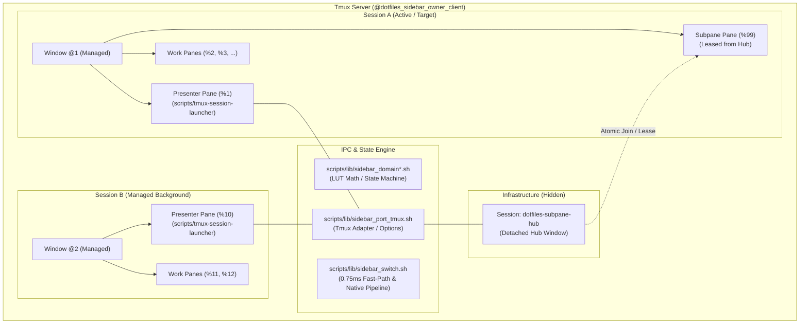
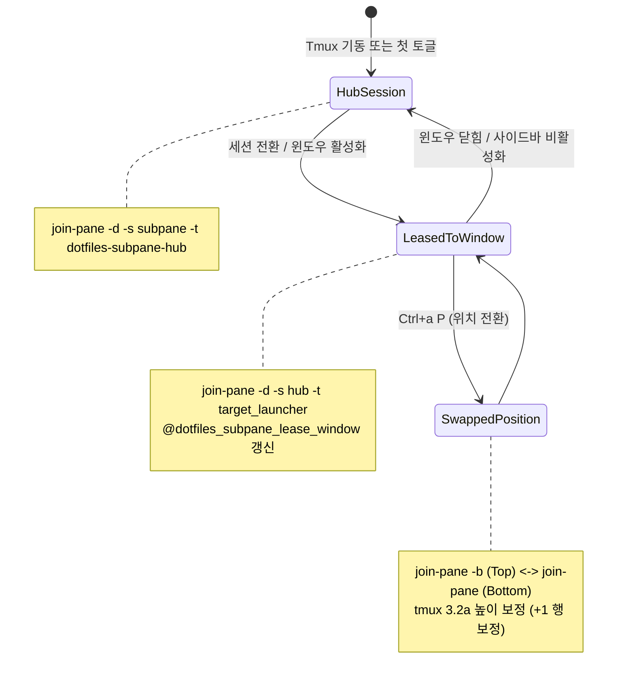
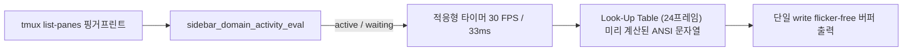

# tmux-session-launcher 시스템 아키텍처 및 내부 구조 (Architecture Internals)

> **현재 기준선 (v0.6.17 / master 최신)**:
> 본 문서는 Window-Local Presenter 모델과 Singleton Subpane Hub(`dotfiles-subpane-hub`)를 기반으로 동작하는
> tmux sidebar session launcher 시스템의 전체 및 서브시스템별 세부 아키텍처 공식 레퍼런스입니다.
> 새로운 AI 세션이나 개발자가 이 문서를 통해 전체 시스템 구조를 즉시 파악하고, 안전하게 확장 및 리팩토링할 수 있도록 작성되었습니다.

---

## 1. 시스템 전체 모델 (System Overview)

tmux sidebar 시스템은 **"Logical Coordinator 1개 + Unique Managed Window당 고정 Thin Presenter 1개 + Singleton Subpane Hub 1개"** 모델을 채택합니다.
물리 pane을 세션 간 이동(`move-pane`)하던 레거시 구조를 완전히 폐기하고, 각 윈도우에 미리 준비된 Presenter에 대해 **Native `switch-client`**만 수행하여 지연 시간과 토폴로지 손상을 원천 박멸했습니다.



---

## 2. 10대 핵심 모듈 아키텍처 (`scripts/lib/`)

코드베이스는 역할과 책임에 따라 10개의 독립 모듈로 격리되어 있으며, 순수 도메인 계층은 tmux I/O 부작용이 전혀 없어 100% 단위 테스트가 가능합니다.

| 모듈 경로 | 역할 및 핵심 기능 | 외부 의존성 |
|---|---|:---:|
| [`scripts/lib/sidebar_domain.sh`](file:///home/al-hub/workspace/dotfiles/scripts/lib/sidebar_domain.sh) | 순수 도메인 헬퍼 (이름 sanitize, 시간 포맷팅, 인프라 세션 필터링, 높이/비율 계산) | **없음 (Pure)** |
| [`scripts/lib/sidebar_domain_activity.sh`](file:///home/al-hub/workspace/dotfiles/scripts/lib/sidebar_domain_activity.sh) | 비동기 AI 활동 추적 및 상태 머신 (`active` ↔ `waiting` ↔ `idle`), 핑거프린트 파서 | **없음 (Pure)** |
| [`scripts/lib/sidebar_domain_animation.sh`](file:///home/al-hub/workspace/dotfiles/scripts/lib/sidebar_domain_animation.sh) | **24프레임 Look-Up Table (LUT) 파형 엔진**, 30 FPS 적응형 클록, CJK/Emoji 폭 측정 | **없음 (Pure)** |
| [`scripts/lib/sidebar_coordinator.sh`](file:///home/al-hub/workspace/dotfiles/scripts/lib/sidebar_coordinator.sh) | 세션 선택 정렬 리듀서 (`selection_coordinator_align_current`), 델타 인덱스 계산 | **없음 (Pure)** |
| [`scripts/lib/sidebar_presenter.sh`](file:///home/al-hub/workspace/dotfiles/scripts/lib/sidebar_presenter.sh) | 키 매핑 테이블, 헤더/푸터 TUI 렌더링 계약 | **없음 (Pure)** |
| [`scripts/lib/sidebar_port_tmux.sh`](file:///home/al-hub/workspace/dotfiles/scripts/lib/sidebar_port_tmux.sh) | Tmux Boundary Adapter (소켓 격리 쿼리, 옵션 읽기/쓰기, 서브페인 상/하 전환) | `tmux` CLI |
| [`scripts/lib/sidebar_subpane_hub.sh`](file:///home/al-hub/workspace/dotfiles/scripts/lib/sidebar_subpane_hub.sh) | **Singleton Subpane Hub(`dotfiles-subpane-hub`)** 수명주기, 원자적 임대(Lease), 지오메트리 보정 | `tmux` CLI |
| [`scripts/lib/sidebar_switch.sh`](file:///home/al-hub/workspace/dotfiles/scripts/lib/sidebar_switch.sh) | **Native 세션 전환 트랜잭션 서비스** (`switch-client \; select-pane` 복합 파이프라인) | `tmux` CLI |
| [`scripts/lib/sidebar_archive.sh`](file:///home/al-hub/workspace/dotfiles/scripts/lib/sidebar_archive.sh) | 결정론적 아카이브 직렬화/역직렬화 (v1/v2/v3 호환), 체크섬 계산, 배치 복원 가드 | `tmux` CLI |
| [`scripts/lib/sidebar_topology.sh`](file:///home/al-hub/workspace/dotfiles/scripts/lib/sidebar_topology.sh) | 윈도우 토폴로지 분석기 (사이드바, 서브페인, 워크페인 단일 진실 공급원) | `tmux` CLI |

---

## 3. IPC & 고속 세션 전환 파이프라인

세션 전환 시 깜박임(Flicker)을 없애고 0.75ms 제자리 즉각 반환과 1000ms 이내의 원자적 전환을 보장합니다.

```mermaid
sequenceDiagram
    autonumber
    actor User as 사용자 (Enter 키 입력)
    participant Presenter as 현재 윈도우 Presenter
    participant SwitchService as sidebar_switch.sh
    participant Tmux as Tmux Server
    participant TargetPres as 타깃 윈도우 Presenter

    User->>Presenter: Enter (Session B 선택)
    alt Fast-Path (현재 세션과 동일)
        Presenter-->>User: 0.75ms 즉각 반환 (Fast-Path)
    else Native 전환 파이프라인
        Presenter->>SwitchService: sidebar_switch_execute_hot(target=Session B)
        SwitchService->>Tmux: Marker Handover (@dotfiles_sidebar_target_marker = Session B)
        SwitchService->>Tmux: 복합 원자 명령 (switch-client -t Session B \; select-pane -t TargetPresenter)
        Tmux-->>TargetPres: 포커스 전환 및 SIGUSR2/Marker 감지
        TargetPres->>TargetPres: sidebar_consume_pending_target_marker()
        TargetPres->>TargetPres: selection_coordinator_align_current()
        TargetPres->>TargetPres: render_marker_delta() (전체 리렌더 억제)
        TargetPres->>Tmux: Selection Sync ACK 게시
    end
```

### 핵심 불변식 (Invariants):
1. **Fast-Path 제자리 전환**: 동일 세션 재선택 시 0.75ms 즉각 반환으로 5초 IPC 타임아웃을 완전 방지.
2. **In-flight Marker Handover**: 전환 직전 타깃 윈도우에 `@dotfiles_sidebar_target_marker`를 발행하여 0번 인덱스 오작동 방지.
3. **Render Delta Coalescing**: 전체 화면(`render_full`) 대신 커서/마커 2개 행만 즉시 갱신(`render_marker_delta`)하여 깜박임 0%.

---

## 4. 서브페인(Subpane) & 허브 라이프사이클

사이드바 내부의 전용 터미널 영역인 Subpane은 서버 전체에서 단 하나의 OS 프로세스/PTY 세션(`dotfiles-subpane-hub`)으로 동작합니다.



- **상/하 위치 스왑 (`Ctrl+a P`)**: 사이드바 내에서 런처 상단(`top`, `-b`) 또는 하단(`bottom`)으로 원자적 이동.
- **tmux 3.2a 하위 호환성 보정**: tmux 3.2a 이하에서 상단 분할 시 테두리(Border) 1행 소실 문제를 `height + 1` 및 리사이즈 파이프라인으로 완전 해결.
- **높이 영속화**: `~/.local/state/dotfiles/tmux-sidebar-subpane-height` 및 `@dotfiles_sidebar_subpane_height` 2중 동기화.

---

## 5. 실시간 TUI & 24프레임 LUT 애니메이션 엔진

백그라운드 AI 프로세스(opencode, aichat 등)의 실행 상태를 실시간 파형으로 표현합니다.



1. **24프레임 Look-Up Table (LUT)**: ANSI 색상 그라데이션 및 문자열 조합을 메모리 테이블에 사전 캐싱하여 CPU 오버헤드를 0.1% 미만으로 유지.
2. **30 FPS 적응형 클록**: AI 작업 중일 때 33ms(30 FPS), 유휴 시 1.0s Sleep으로 전력 소모 최소화.
3. **CJK/Emoji 너비 보존 토크나이저**: 한글 및 이모지(2셀)가 포함된 세션 이름에서도 파형이 깨지지 않도록 정밀 셀 너비 보존.

---

## 6. 세션 아카이브 & 배치 복원 파이프라인

- **결정론적 아카이브 명명**: 세션 이름 및 타임스탬프를 안전하게 인코딩.
- **레이아웃 무결성 직렬화 (Version 3)**: 워크 페인의 상대 좌표, 가로/세로 분할 비율, active pane 정보를 보존하며, 복원 시 사이드바 및 서브페인과 완벽히 결합.
- **다중 일괄 복원(Batch Restore)**: 6/6 복원 진행률(`Restoring n/6`) 및 타임스탬프 로깅 지원.

---

## 7. 향후 AI 세션을 위한 수정 및 확장 가이드 (Developer Notes)

1. **순수 비즈니스 로직 수정 시**: `scripts/lib/sidebar_domain*.sh`에 함수를 추가하고 `tests/tmux-single-sidebar/test-domain-unit.sh`로 즉시 검증하십시오.
2. **Tmux 상호작용 수정 시**: `scripts/tmux-session-launcher`에 직접 `tmux` 명령을 넣지 말고, 반드시 `scripts/lib/sidebar_port_tmux.sh`를 거치도록 하십시오.
3. **세션 전환 수정 시**: `scripts/lib/sidebar_switch.sh`의 원자적 복합 파이프라인(`switch-client \; select-pane`) 불변식을 준수하십시오.
4. **테스트 검증**: 변경 후 반드시 `bash tests/run-tests.sh --gate a` 및 `bash tests/run-tests.sh --edge`를 실행하십시오.
